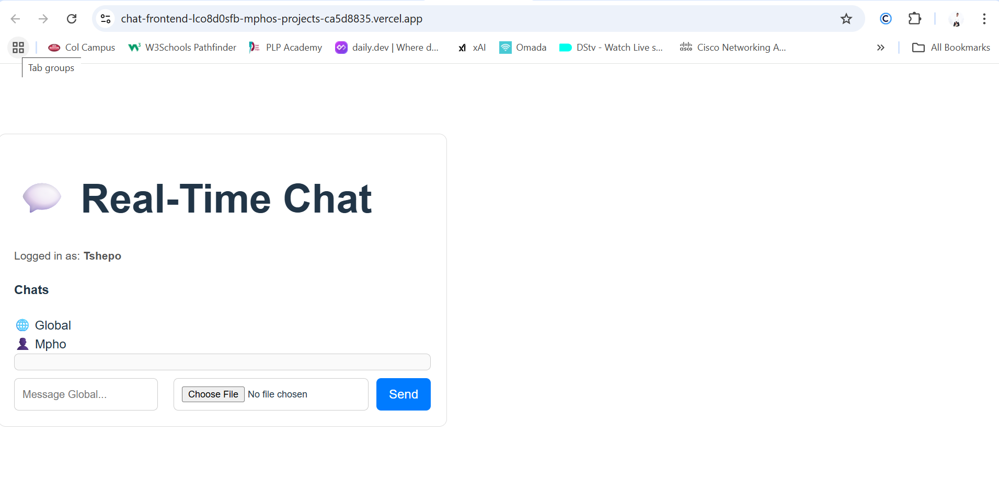
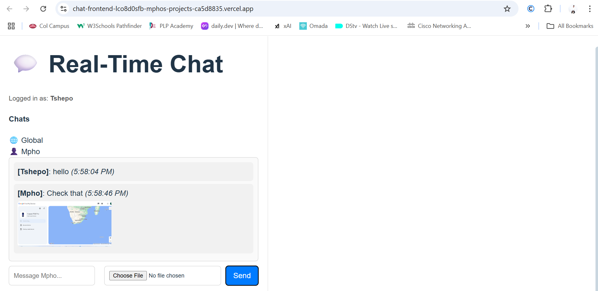

# 💬 Real-Time Chat Application

A full-stack real-time chat application with global chat, private messaging, file sharing, and online user tracking — built using **React**, **Node.js**, **Express**, and **Socket.io**.

---

## 🌐 Live Demo

- 🔗 **Frontend**: [https://chat-frontend-lco8d0sfb-mphos-projects-ca5d8835.vercel.app](https://chat-frontend-lco8d0sfb-mphos-projects-ca5d8835.vercel.app)
- 🔗 **Backend**: [https://chat-backend-vacz.onrender.com](https://chat-backend-vacz.onrender.com)

---

## ✨ Features

### ✅ Core
- Username-based login prompt
- Real-time global chat
- Display messages with sender name and timestamp
- Online users display
- Typing indicator

### 🔒 Private Messaging
- WhatsApp-style tabs for private chats

### 📎 File/Image Sharing
- Upload and display images inline

### 🔔 Notifications (Sound/Visual)
- Typing and message alerts

---

## 🛠️ Tech Stack

- **Frontend**: React, Vite, Tailwind CSS, Socket.io-client
- **Backend**: Node.js, Express, Socket.io
- **Deployment**:
  - Frontend: Vercel
  - Backend: Render

---

## 📷 Screenshots

| Global Chat | Private Chat |
|-------------|--------------|
|  |  |

| File Upload | Typing Indicator |
|-------------|------------------|
| 

*(Replace with your own screenshots or GIFs)*

---

## 🚀 How to Run Locally

1. **Clone the repo**
```bash
git clone https://github.com/PLP-MERN-Stack-Development/week-5-web-sockets-assignment-Gatsheni528.git
